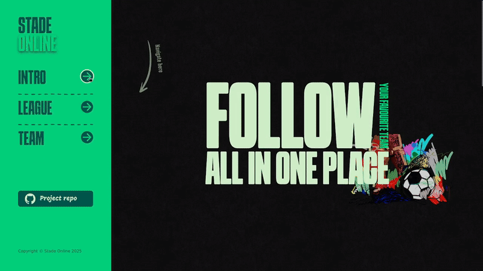
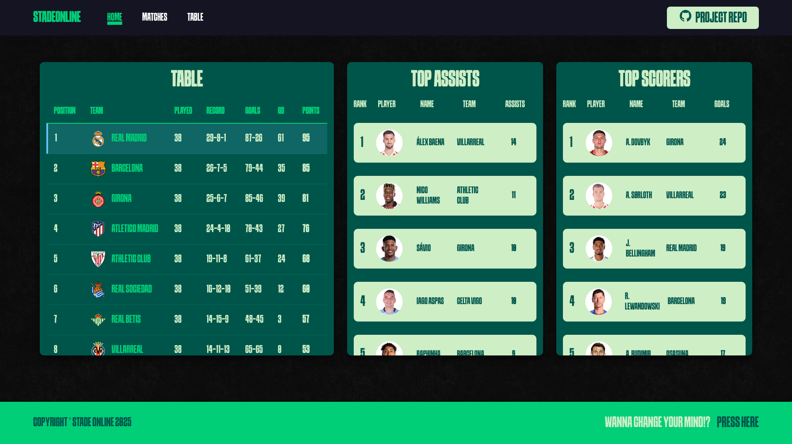
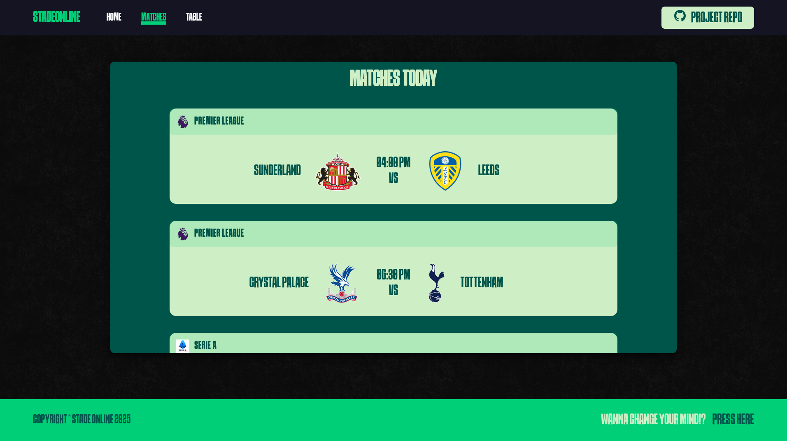
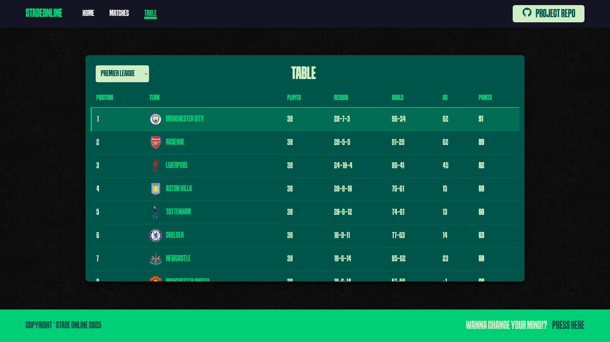

# ⚽ StadeOnline

StadeOnline is a football statistics web application developed as a college project, 
based on an idea provided by the course instructor.

The application allows users to select their favorite football league and team 
and view key football statistics through a clean and responsive interface.

## 🔗 Live Demo
👉 https://stadeonline.infinityfree.me/

## 📸 Screenshots

## ✨ Features

* Select favorite football league and team
* Display league table with standings
* Show top scorers and top assisters
* View all matches scheduled for today
* View league table for any selected league
* Responsive and user-friendly UI

## 🛠 Technologies Used

* HTML5
* CSS3 (Flexbox, Grid, Advanced CSS)
* JavaScript (ES6+)
* PHP
* REST APIs
* Git & GitHub

## ⚙ Installation & Setup

To run the project locally:
1. Clone the repository:
`git clone https://github.com/Distorver/StadeOnline.git`
2. Move the project to your local server directory:
* XAMPP: htdocs
* WAMP: www
* Linux (Apache): /var/www/html
3. Start Apache (and MySQL if needed)
4. Open your browser and go to:
`http://localhost/StadeOnline`

## 🎓 Project Context

This project was developed as part of a college course.
The original idea was provided by the course instructor and implemented independently.

## 🚀 Future Improvements

* Migrate front-end to React
* Improve UI/UX
* Add user authentication
* Add more detailed statistics
* Optimize performance

## 📬 Contact

* LinkedIn: www.linkedin.com/in/3li-ayman